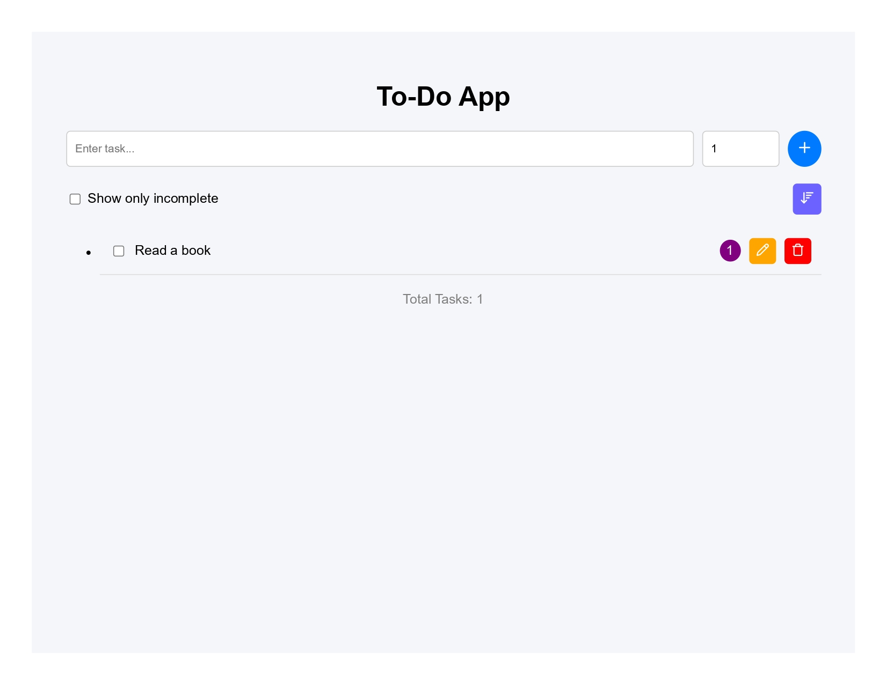

# React To-Do Project

A modern task management app built with **React** and **Vite**.  
This project helps you add, edit, delete, sort, and filter tasks. Tasks are stored in **localStorage** so they persist between sessions.

---

## 🔹 Features

- Add new tasks with a text description
- Edit existing tasks
- Delete tasks
- Mark tasks as complete or incomplete
- Filter to show only incomplete tasks
- Sort tasks by priority
- Data persistence using localStorage
- Clean and responsive component-based UI
- Styled with separate CSS files for maintainability

---

## 🖼 Screenshots

### Main App View


---

## 💻 Tech Stack

- **React** (Functional Components & Hooks)  
- **Vite** (Development Server & Build Tool)  
- **CSS** (Separate files for each component)  
- **Lucide React** (Icons)

---

## 🚀 How to Run Locally

1. Clone the repository:

```bash
git clone https://github.com/Siraj496/react-todo-project.git
